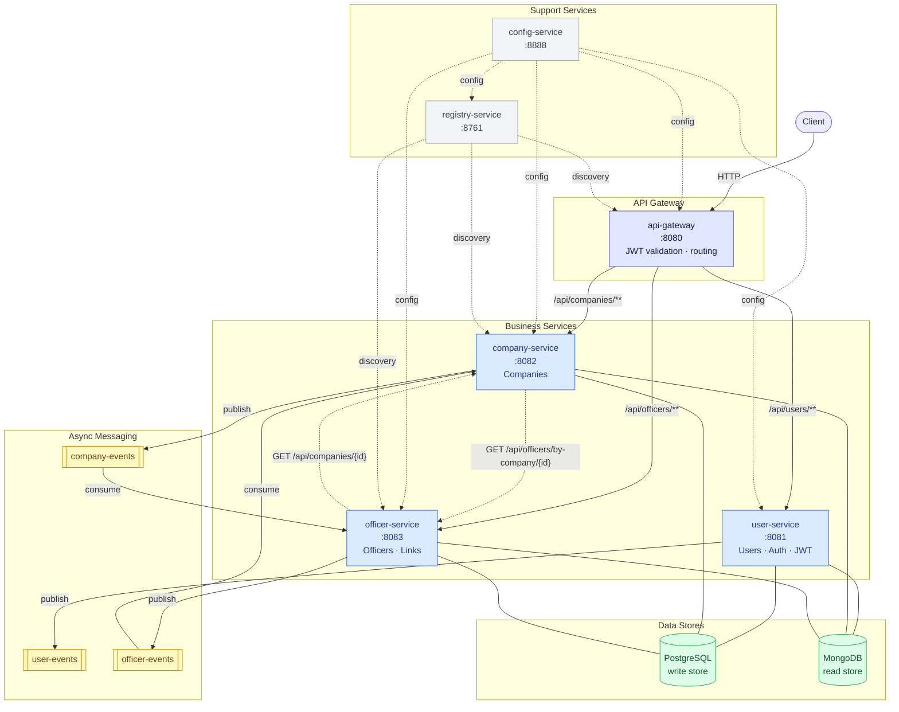

# Service Architecture

This diagram shows all inter-service relationships: HTTP routing through the gateway, synchronous Feign calls between business services, asynchronous Kafka event flows, and shared infrastructure dependencies.

## Legend

| Arrow style | Meaning |
|---|---|
| Solid `-->` | Synchronous HTTP (gateway routing) |
| Dotted `-.->`| Synchronous HTTP (Feign inter-service call) |
| Solid `-->` (Kafka) | Async event published to Kafka topic |
| Dashed `-.->`(support) | Config fetch / service discovery |

## Key relationships

**Gateway routing** — all external traffic enters through the api-gateway on port 8080. The gateway validates the JWT signature before forwarding to the target service.

**Feign calls (synchronous)** — two bidirectional sync dependencies exist between company-service and officer-service. Both are wrapped in Resilience4j circuit breakers with distinct fallback strategies: company-service degrades gracefully (returns the company without officers + a warning), while officer-service fails fast (503) to protect data integrity when linking an officer to an unverified company.

**Kafka events (asynchronous)** — each service publishes domain events to its own topic. Cross-service consumers: officer-service listens to `company-events` (e.g. company deleted → clean up links), company-service listens to `officer-events` (e.g. officer updated → refresh read model). Each service also consumes its own topic for internal CQRS read-model sync (PostgreSQL → MongoDB).

**Data stores** — every business service owns two stores: PostgreSQL (write/command side, source of truth) and MongoDB (read/query side, denormalized projections). No service accesses another service's database.
